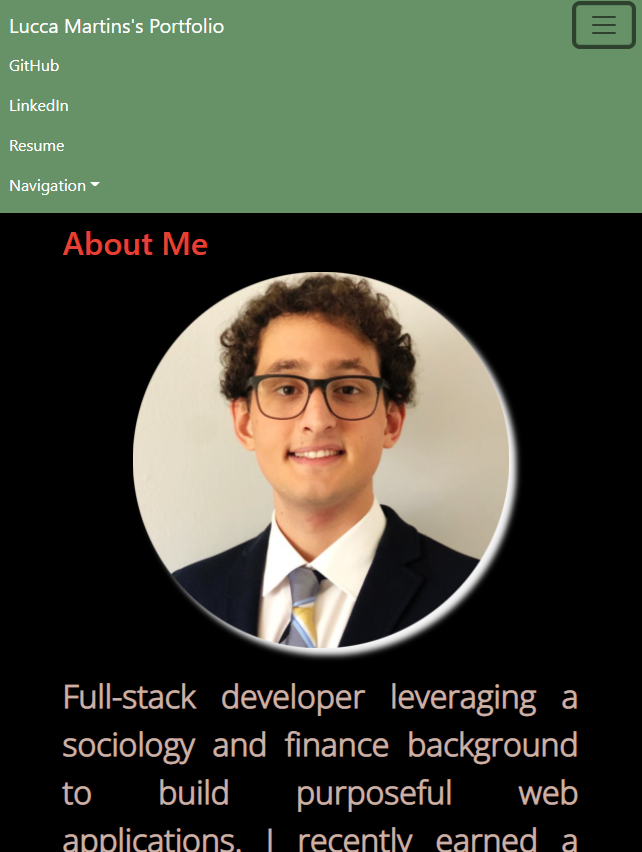
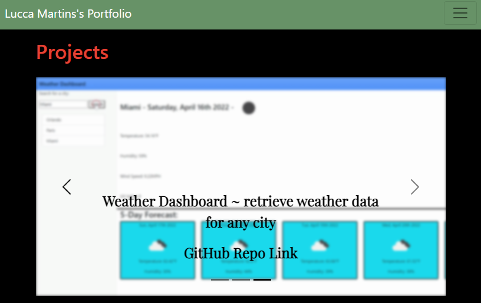

# Professional Portfolio

## **Deployed Link**

Please click on the following link to be navigated to the portfolio: https://shielded-taiga-41680.herokuapp.com/

## **Contact Info**

* `Email:` luccamartins2012@gmail.com
* `GitHub Profile:` https://github.com/luccaloopz

## **Languages Used**

* HTML
* CSS
* JavaScript

## **Description**

The purpose of this project was to create a portfolio showcasing some of my newer coding projects. The site includes an "About Me" section where the visitor will find a picture of myself as well as a small blurb describing myself as a software developer. The site also includes a "Contact Info" section as well as a navigation bar at the top of the site that includes a link to my GitHub profile, LinkedIn profile, and Resume. 

## **Application**

Picture of the heading as well as the nav bar which includes hyperlinks to other websites, other parts of the page, and a contact info popup.

Picture of the project tiles. They include the title of the project, a brief description, and a link to the GitHub repo.

## **LICENSE**

The following application is covered under the MIT License.